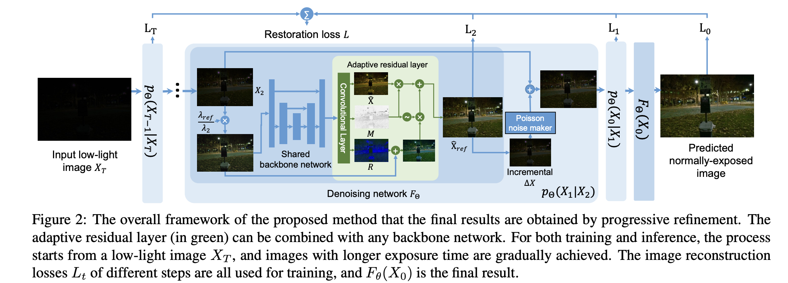

# [ICCV 2023] ExposureDiffusion: Learning to Expose for Low-light Image Enhancement
[](https://iccv2023.thecvf.com/)


  
Welcome! This is the official implementation of the paper "[ExposureDiffusion: Learning to Expose for Low-light Image Enhancement](https://arxiv.org/pdf/2307.07710.pdf)".

- *Yufei Wang, Yi Yu, Wenhan Yang, Lanqing Guo, Lap-Pui Chau, Alex C. Kot, Bihan Wen*

- $^1$ Nanyang Technological University 
$^2$ Peng Cheng Laboratory
$^3$ The Hong Kong Polytechnic University

## News
**_(2023.8.08)_**: The training and testing codes are released

**_(2023.7.14)_**: 🎉 Our paper was accepted by ICCV 2023


## Highlight
- The first diffusion model designed for low-light image enhancement (LLIE) in raw space. 
- Better performance than vanilla conditional diffusion models for image restoration: better performance using fewer inference steps (e.g., only 3 steps) and fewer parameters.
- Can be combined with SOTA noise models and denoising backbones.
- (*For using diffusion models for the LLIE task in the sRGB space, we recommend our recent work
[ShadowDiffusion: When Degradation Prior Meets Diffusion Model for Shadow Removal](https://openaccess.thecvf.com/content/CVPR2023/papers/Guo_ShadowDiffusion_When_Degradation_Prior_Meets_Diffusion_Model_for_Shadow_Removal_CVPR_2023_paper.pdf) (Table 6 in the paper).*)

## Overall

<p align="center">

</p>

- We propose to use a diffusion model to simulate the real exposure process. The noisy image with a short exposure time is an intermediate step $X_t$ in the diffusion process, i.e., the initial step $X_T$ is the input low-light image in our method instead of from a pure noise in vanilla conditional diffusion models for image restoration


- To integrate the noisy image into the diffusion process, we do some key modifcations to the assumpation of the diffusion process, which is summarized as follows.



- The overall training/inference pipeline is as follows where we start from the low-light image $X_T$, instead of a Gaussian noise. 

## Prerequisites
Please install the packages required by [ELD](https://github.com/Vandermode/ELD).

Beisdes, you may need to download the ELD dataset and SID dataset as follows

- ELD ([official project](https://github.com/Vandermode/ELD)): [download (11.46 GB)](https://drive.google.com/file/d/13Ge6-FY9RMPrvGiPvw7O4KS3LNfUXqEX/view?usp=sharing)  
- SID ([official project](https://github.com/cchen156/Learning-to-See-in-the-Dark)):  [download (25 GB)](https://storage.googleapis.com/isl-datasets/SID/Sony.zip)

## Train
For the training of models with the UNet backbone:

```bash
# For the training of P+g noise model (results in Table 2, 3, 4, 5)
python3 train_syn.py --name sid_Pg --include 4 --noise P+g --model eld_iter_model --with_photon --adaptive_res_and_x0 --iter_num 2 --epoch 300 --auxloss --continuous_noise --adaptive_loss

# For the training of P+G+r+u noise model, i.g., ELD noise model (results in Table 4, 5)
python3 train_syn.py --name sid_PGru --include 4 --noise P+G+r+u --model eld_iter_model --with_photon --adaptive_res_and_x0 --iter_num 2 --epoch 300 --auxloss --concat_origin --continuous_noise --adaptive_loss

# For the training of the model based on real-captured paried data (results in Table 4)
CUDA_VISIBLE_DEVICES=1 python3 train_real.py --name sid_real --model eld_iter_model --with_photon --adaptive_res_and_x0 --iter_num 2 --epoch 300 --auxloss --concat_origin --adaptive_loss
```

For the training of the models with NAFNet backbone (results in Table 5):
```bash
# NAFNet with P+g noise model
CUDA_VISIBLE_DEVICES=0 python3 train_syn.py --name sid_Pg_naf2 --include 4 --noise P+g --model eld_iter_model --with_photon --adaptive_res_and_x0 --iter_num 2 --epoch 300 --auxloss --continuous_noise --adaptive_loss --netG naf2

# NAFNet with ELD noise model
CUDA_VISIBLE_DEVICES=0 python3 train_syn.py --name sid_PGru_naf2 --include 4 --noise P+G+r+u --model eld_iter_model --with_photon --adaptive_res_and_x0 --iter_num 2 --epoch 300 --auxloss --concat_origin --continuous_noise --adaptive_loss --netG naf2
```


## Pre-trained models
You can download the pre-trained models from [google drive], which includes the following models
- The UNet model trained on P+g noise model, ELD noise model, and real-captured paired dataset. 
- The NAFNet model trained on P+g and ELD noise models.

## Test
For the evaluation of models, you shall use the same hyper-parameters (i.e., the same usage of ```--concat_origin``` ) with the training ones. For example, if you want to evaluate the performance of the models based on NAFNet, you shell use the following commands

```bash
# Test of the ELD+NAFNet model
python3 test_ELD.py --model eld_iter_model --model_path "the path of the ckpt" --include 4 --with_photon --adaptive_res_and_x0 -r --iter_num 2 --netG naf2 --concat_origin

# Test of the Pg+NAFNet model
python3 test_SID.py --model eld_iter_model --model_path "the path of the ckpt" --include 4 --with_photon --adaptive_res_and_x0 -r --iter_num 2 --netG naf2
```


For the evaluation of ELD dataset, we just keep the other settings the same, and only change the file name from ```test_SID.py``` to ```test_ELD.py```. For example, the command to evaluate the performance of the UNet model trained on real data is as follows

```bash
python3 test_SID.py --model eld_iter_model --model_path checkpoints/sid_real/model_300_00386400.pt --concat_origin --adaptive_res_and_x0 --with_photon -r --include 4
```

To evaluate the effect of different inference steps, you can change the value of ```--iter_num``` (default: 2). You can get a similar result as the following one where we evaluate the quality of the predicted clean image of each step

<p align="center">

</p>

- The proposed method can get converged in 3 steps, which is much faster than DDIM. Besides, better performance is achieved under a smaller number of parameters.


## Results

<p align="center">

</p>

- The proposed method can be combined with real-captured paired data/different SOTA noise models. Stable improvement are achieved.

<p align="center">

</p>

- The proposed method can also be combined with different backbone networks, e.g., SOTA denosing backbone NAFNet. Models of different sizes have significant performance improvements

## Citation
If you find our code helpful in your research or work please cite our paper.

```bibtex
@article{wang2023exposurediffusion,
  title={ExposureDiffusion: Learning to Expose for Low-light Image Enhancement},
  author={Wang, Yufei and Yu, Yi and Yang, Wenhan and Guo, Lanqing and Chau, Lap-Pui and Kot, Alex C and Wen, Bihan},
  journal={arXiv preprint arXiv:2307.07710},
  year={2023}
}
```
## Copyright
The purpose of the use is non-commercial research and/or private study.

## Acknowledgement
This work is based on [ELD](https://github.com/Vandermode/ELD) and [PMN](https://github.com/megvii-research/PMN.). We sincelely appreciate the support from the authors.

## Contact
If you would like to get in-depth help from me, please feel free to contact me (yufei001@ntu.edu.sg) with a brief self-introduction (including your name, affiliation, and position).
